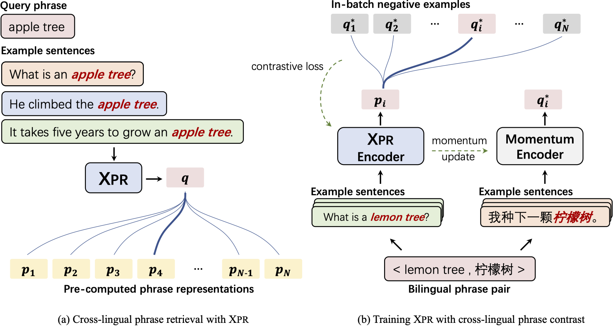
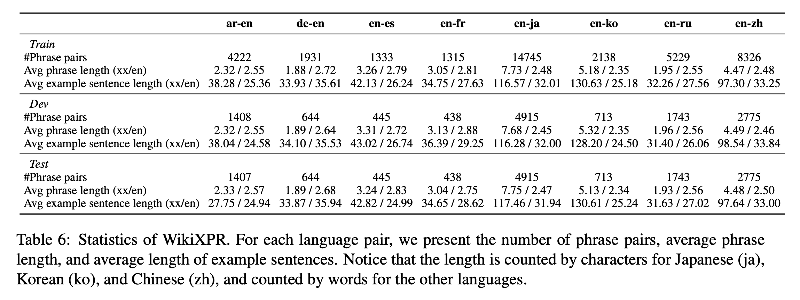

# Cross-lingual Phrase Retriever
This repository contains the code and pre-trained models for our paper XPR: Cross-lingual Phrase Retriever.

**************************** **Updates** ****************************

- 5/10 We released our [model checkpoint](https://huggingface.co/cwszz/XPR), [evaluation code](./predict.py) and [dataset](https://drive.google.com/file/d/1UEHqQhVj1V4mwKqs5iNdOxvRKurLUfoF/view?usp=sharing).
- 4/19 We released [our paper](https://arxiv.org/abs/2204.08887). 
- 2/26 Our paper has been accepted to **ACL2022**.

## Overview

We propose a cross-lingual phrase retriever that extracts phrase representations from unlabeled example sentences named XPR.



## Dataset

We also create a large-scale cross-lingual phrase retrieval dataset, which contains 65K bilingual phrase pairs and 4.2M example sentences in 8 English-centric language pairs.


## Getting Started
In the following sections, we describe how to use our XPR.
### Requirements
- First, install PyTorch by following the instructions from [the official website](https://pytorch.org). To faithfully reproduce our results, please use the correct `torch==1.8.1+cu111` version corresponding to your platforms/CUDA versions. PyTorch version higher than `1.8.1` should also work. 
- Then, run the following script to fetch the repo and install the remaining dependencies.
```bash
git clone git@github.com:cwszz/XPR.git
cd xpr
pip install -r requirements.txt
mkdir data
mkdir model
mkdir result
```
### Dataset

Before using XPR, please process the dataset by following the steps below.

- Download Our Dataset Here: [link](https://drive.google.com/file/d/1UEHqQhVj1V4mwKqs5iNdOxvRKurLUfoF/view?usp=sharing)

- Unzip our dataset and move dataset into data folder. (Make sure the path in bash file is the path of dataset)

### Checkpoint

Before using XPR, please process the checkpoint by following the steps below.

- Download Our Checkpoint Here: [link](https://huggingface.co/cwszz/XPR)

- Get our checkpoint files and move the files in repo into model folder.

### Train XPR
<!-- Download XLMR checkpoint from Huggingface page: [link](https://huggingface.co/xlm-roberta-base). -->
```
bash train.sh
```

### Evaluation


Test our method:
- Download the XPR checkpoint from Huggingface:
[link](not finished)
- Make sure **the model path and dataset path** in test.sh are correct
- The output log can be found in log folder 

Here is an example for evaluate XPR:
```
bash test.sh
```
or
```
export CUDA_VISIBLE_DEVICES='0'
python3 predict.py \
--lg $lg \
--test_lg $test_lg \
--dataset_path ./datset/ \
--load_model_path ./model/pytorch_model.bin \
--queue_length 0 \
--unsupervised 0 \
--wo_projection 0 \
--layer_id = 12 \
> log/test-${lg}-${test_lg}-32.log 2>&1
```

- $lg: The language on which the model was trained
- $test_lg: The language on which the model will be tested on
- --dataset_path: The path of dataset folder
- --load_model_path: The path of checkpoint folder
- --queue_length: The length of memory queue
- --unsupervised: Unsupervised mode
- --wo_projection: Without SimCLR projection head
- --layer_id: The layer to represent phrase


## References
Please cite this paper, if you found the resources in this repository useful.
<!-- Train our method:

```
CUDA_VISIBLE_DEVICES=0,1 python3 -m torch.distributed.launch  --nproc_per_node=2 \
--master_port 29501 trainMoCo.py --output_log_dir log_output --seed 42 \
--T_para 0.06 --simclr 0 --quene_length 0  --all_sentence_num 32 --train_sample_num 4 \
--dev_sample_num 32 --dev_only_q_encoder 1 --lg 'fr'
``` -->


<!-- ```
CUDA_VISIBLE_DEVICES=0 python3 -m torch.distributed.launch --nproc_per_node=1 --master_port 29501 predict.py  --lg 'fr' --sn '32' --test_lg 'fr' \
--output_log_dir 'test_result' --simclr 0 --quene_length 0 --T_para 0.06 --seed 42 --test_dev 0 --unsupervised 0 --wolinear 0
``` -->


<!-- ## Results:

### Unsupervised Setting

|Model|ar-en|de-en|en-es|en-fr|en-ja|en-ko|en-ru|en-zh|avg|
|:--:|:--:|:--:|:--:|:--:|:--:|:--:|:--:|:--:|:--:|
|CLWE|2.74|0.78|0.00|1.02|0.34|0.28|1.32|0.12|0.83|
|CLSE|9.70|19.10|29.21|20.89|4.83|11.50|16.98|8.76|15.12|
|XPR|**14.71**|**28.96**|**42.25**|**39.38**|**7.34**|**15.22**|**24.24**|**11.26**|**22.92**|


### Supervised Setting

|Model|ar-en|de-en|en-es|en-fr|en-ja|en-ko|en-ru|en-zh|avg|
|:--:|:--:|:--:|:--:|:--:|:--:|:--:|:--:|:--:|:--:|
|CLWE|56.14|33.62|63.71|51.26|31.62|50.14|38.67|30.02|44.40|
|CLSE|20.58|18.79|36.06|26.60|16.73|24.58|21.32|17.69|22.79|
|XPR|**88.63**|**81.44**|**84.53**|**80.18**|**87.32**|**80.83**|**91.00**|**77.62**|**83.94**|

### Zero-shot  (ZH) Setting

|Model|ar-en|de-en|en-es|en-fr|en-ja|en-ko|en-ru|en-zh|avg|
|:--:|:--:|:--:|:--:|:--:|:--:|:--:|:--:|:--:|:--:|
|CLWE|0.04|0.32|0.22|0.23|0.00|2.24|0.09|30.02|4.15|
|CLSE|6.18|10.25|16.07|10.39|6.73|9.75|8.35|17.69|10.68|
|XPR|**74.12**|**73.60**|**82.54**|**77.36**|**73.04**|**78.52**|**79.10**|**77.62**|**76.99**|

### Multi-lingual supervised Setting

|Model|ar-en|de-en|en-es|en-fr|en-ja|en-ko|en-ru|en-zh|avg|
|:--:|:--:|:--:|:--:|:--:|:--:|:--:|:--:|:--:|:--:|
|CLWE|12.33|1.87|6.63|3.77|18.46|4.00|9.84|11.19|8.51|
|CLSE|11.98|19.64|29.44|21.58|11.91|14.73|18.01|14.50|17.72|
|XPR|**91.90**|**82.76**|**90.79**|**85.16**|**90.16**|**88.22**|**93.09**|**86.47**|**88.57**| -->
